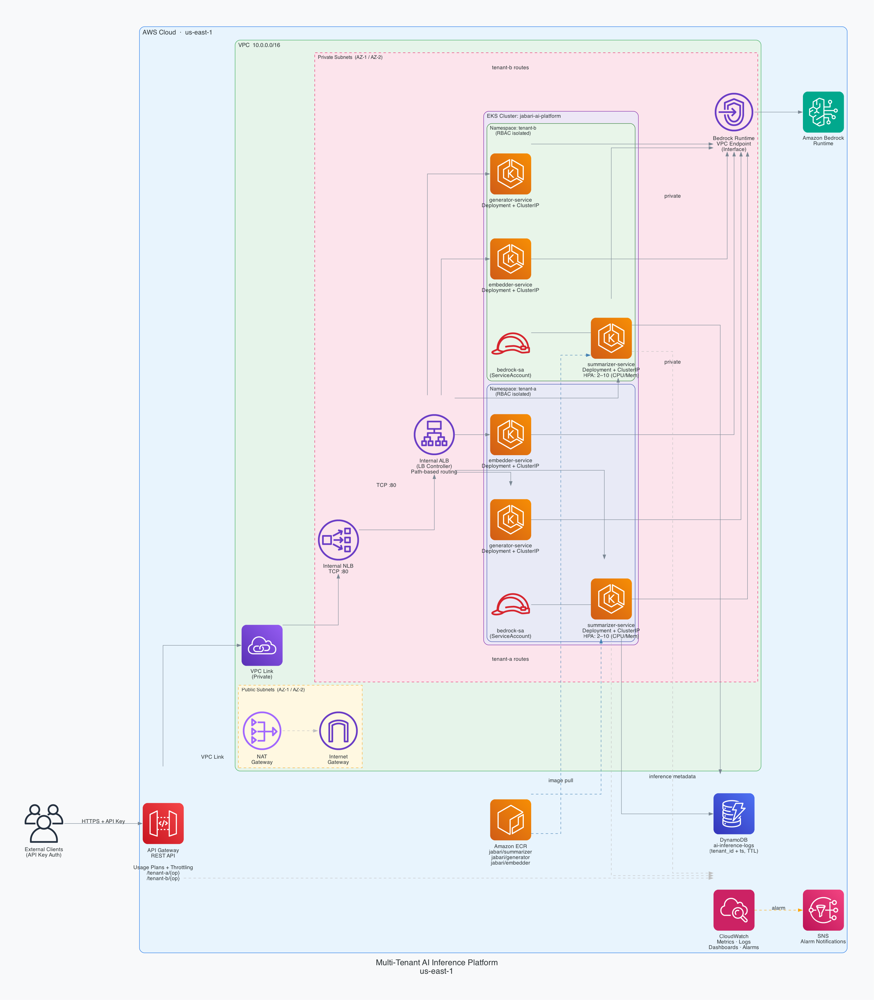
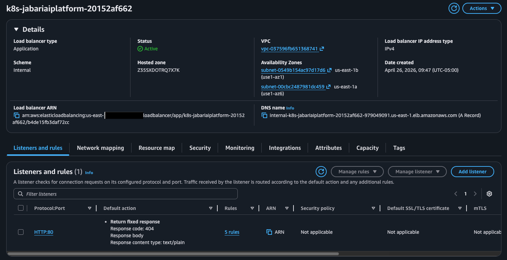
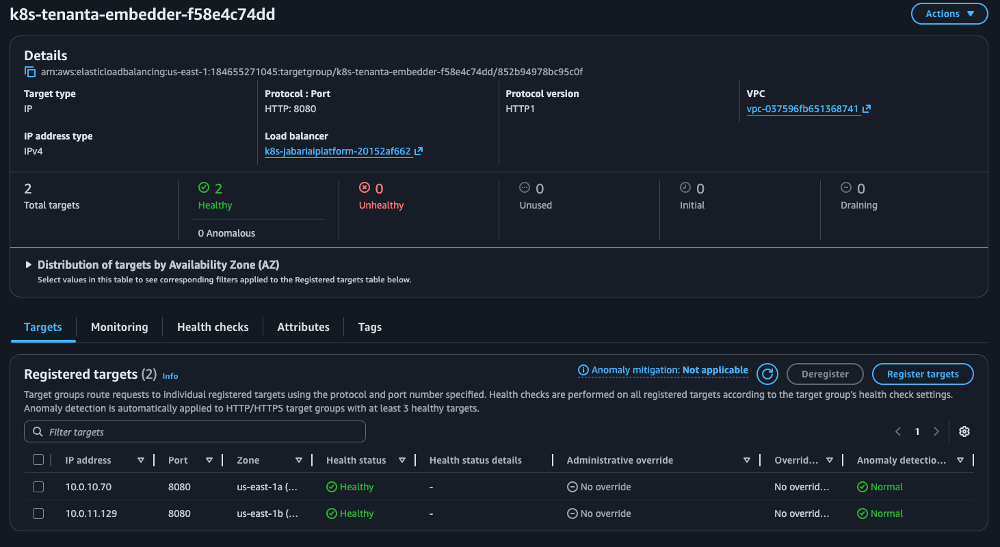
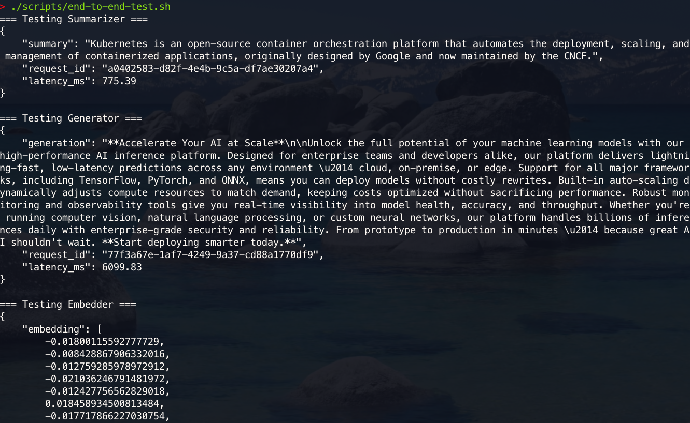
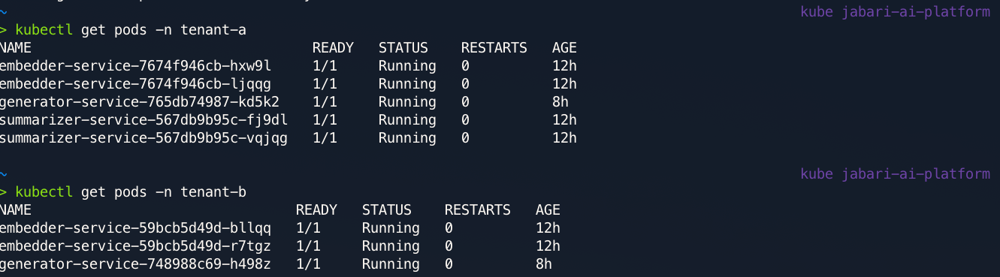
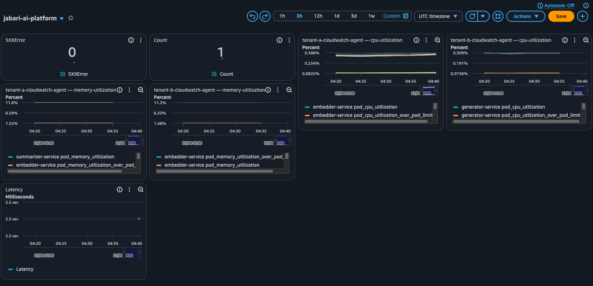

# Multi-Tenant AI Inference Platform

A production-style AI inference platform that exposes multiple Amazon Bedrock-backed model services through one tenant-aware API, while isolating tenant workloads on Amazon EKS.


## Architecture



```text
Client
  |
  v
API Gateway REST API
  |  paths: /tenant-a/summarize, /tenant-a/generate, /tenant-a/embed
  |         /tenant-b/summarize, /tenant-b/generate, /tenant-b/embed
  |
  v
API Gateway VPC Link
  |
  v
Internal Network Load Balancer
  |
  v
Internal ALB from AWS Load Balancer Controller
  |
  +-- tenant-a namespace
  |     +-- summarizer-service --> Bedrock Claude Haiku
  |     +-- generator-service  --> Bedrock Claude Sonnet
  |     +-- embedder-service   --> Bedrock Titan Embed
  |
  +-- tenant-b namespace
        +-- summarizer-service --> Bedrock Claude Haiku
        +-- generator-service  --> Bedrock Claude Sonnet
        +-- embedder-service   --> Bedrock Titan Embed

Each service writes request metadata to DynamoDB.
CloudWatch Container Insights, dashboards, and alarms monitor the platform.
```

## How It Works

1. A client sends a POST request to API Gateway using a tenant path such as `/tenant-a/summarize` and includes that tenant's API key in the `x-api-key` header.
2. API Gateway validates the API key against the tenant usage plan, applies the tenant's throttle and quota settings, then forwards the request through a VPC Link.
3. The VPC Link sends private traffic to an internal Network Load Balancer. The NLB forwards TCP traffic to the internal ALB created by the AWS Load Balancer Controller.
4. The ALB Ingress rules route by path into the correct Kubernetes namespace and service: summarizer, generator, or embedder.
5. Each FastAPI service runs as a container on EKS, assumes the Bedrock inference role through IRSA, and calls the appropriate Amazon Bedrock model.
6. The service returns the inference result to the caller and records request metadata in DynamoDB, including tenant ID, service name, model name, latency, token counts, timestamp, and TTL.
7. Kubernetes HPAs scale the summarizer deployments by CPU and memory utilization, while CloudWatch dashboards and alarms track API health, node CPU, and HPA saturation.

## Key Design Decisions

### 1. EKS namespaces for tenant isolation

I used one namespace per tenant instead of only tagging requests inside a shared deployment. That gives the platform a real Kubernetes isolation boundary for RBAC, service accounts, resource quotas, deployments, services, HPAs, and Ingress routing.

### 2. Tenant identity is deployment-owned

The services read `TENANT_ID` from Kubernetes deployment configuration instead of trusting a caller-supplied header. This prevents a caller from spoofing another tenant in the metadata logs and keeps tenant attribution tied to the workload that handled the request.

### 3. API Gateway in front of private Kubernetes services

The public entry point is API Gateway, while the EKS services remain behind private load balancers. This keeps the API surface simple for clients and lets the platform use API keys, usage plans, quotas, and throttling before traffic reaches the cluster.

### 4. NLB bridge between API Gateway VPC Link and ALB Ingress

API Gateway VPC Link integrates with a Network Load Balancer, while Kubernetes path routing is naturally handled by an ALB Ingress. The platform uses an internal NLB targeting the internal ALB so API Gateway can reach Kubernetes while preserving path-based service routing.

### 5. DynamoDB for low-friction request metadata

Request logs are stored in DynamoDB with a tenant/timestamp GSI and TTL. This keeps per-request metadata queryable by tenant without managing a database server, and TTL automatically expires older inference records.

### 6. Bedrock access through IRSA and a private VPC endpoint

Pods use an annotated Kubernetes service account to assume the Bedrock inference IAM role. The VPC also includes a Bedrock Runtime interface endpoint with private DNS so model calls stay on private AWS networking where supported.

## AWS Services Used

- **Amazon EKS** - runs the tenant-isolated Kubernetes workloads.
- **Amazon Bedrock** - provides the Claude and Titan model backends used by the inference services.
- **API Gateway REST API** - exposes the tenant and model endpoints, API keys, usage plans, throttles, and quotas.
- **VPC Link** - connects API Gateway privately to the platform NLB.
- **Elastic Load Balancing** - uses an internal NLB for VPC Link and an internal ALB for Kubernetes Ingress path routing.
- **Amazon VPC** - provides public and private subnets across two Availability Zones, NAT gateways, routing, and private endpoint networking.
- **Amazon ECR** - stores Docker images for the summarizer, generator, and embedder services.
- **DynamoDB** - stores inference request metadata with a tenant/timestamp index and TTL cleanup.
- **IAM and IRSA** - provide least-privilege roles for EKS, worker nodes, load balancer controller, and Bedrock workloads.
- **CloudWatch** - hosts Container Insights metrics, dashboards, and alarms for API, node, and HPA health.
- **SNS** - optionally sends CloudWatch alarm notifications by email.

## Prerequisites

### Required Tools

- AWS CLI v2.x - used by Terraform, ECR login, EKS kubeconfig, and helper scripts.
- Terraform - used for infrastructure in `terraform/`; see `terraform/versions.tf` for the configured provider requirements.
- Docker - builds and pushes the three service images.
- kubectl - applies Kubernetes manifests and inspects EKS resources.
- Helm 3+ - installs the AWS Load Balancer Controller.
- curl - downloads AWS controller and Container Insights manifests.
- Python 3 - formats smoke test JSON responses with `python3 -m json.tool`.

### AWS Account Requirements

- Use `us-east-1` for this project.
- AWS credentials must be configured for Terraform and the helper scripts.
- Bedrock model access must be enabled for the Claude and Titan models used by the services.
- The AWS principal deploying this project needs permissions for VPC, EKS, IAM, ECR, Bedrock, API Gateway, Elastic Load Balancing, DynamoDB, CloudWatch, and SNS.

Do not set `AWS_REGION` as an environment variable for this project. The scripts use `us-east-1` directly where they need a region.

## Setup and Deployment

### 1. Clone the Repository

```bash
git clone <repo-url>
cd Multi-Tenant-AI-Inference
```

### 2. Deploy the AWS Infrastructure

```bash
cd terraform
terraform init
terraform plan
terraform apply
cd ..
```

The first Terraform apply creates the VPC, EKS cluster, node group, IAM roles, ECR repositories, DynamoDB table, API Gateway, NLB, CloudWatch dashboard, and alarms. The ALB target attachment is completed after Kubernetes Ingress creates the internal ALB.

### 3. Configure kubectl for EKS

```bash
./scripts/01_configure-kubectl-eks.sh
```

### 4. Install the AWS Load Balancer Controller

```bash
./scripts/02_install-aws-load-balancer-controller.sh
```

This script creates or updates the controller IAM role and installs the Helm chart into `kube-system`.

### 5. Install the Metrics Server and Container Insights

```bash
./scripts/03_install-metrics-server.sh
./scripts/04_install-cloudwatch-container-insights.sh
```

The metrics server feeds Kubernetes HPA metrics. Container Insights sends pod, node, and log telemetry to CloudWatch for the dashboard and alarms.

### 6. Build and Push Service Images

```bash
./scripts/05_build-push-ecr.sh
```

The image build script uses Docker `--provenance=false`, which is required for AWS container image compatibility in this project.

### 7. Apply Kubernetes Manifests and Wire the Load Balancers

```bash
./scripts/06_apply-k8s-manifests.sh
```

This applies namespaces, RBAC, deployments, services, HPAs, and Ingress objects. It then waits for the internal ALB, resolves its ARN, registers it with the NLB target group, and waits for target health.

### 8. Run the End-to-End Smoke Test

```bash
API_KEY="$(terraform -chdir=terraform output -raw tenant_a_api_key_value)"
API_URL="$(terraform -chdir=terraform output -raw api_gateway_stage_invoke_url)"
./scripts/end-to-end-test.sh
```

The smoke test calls summarize, generate, and embed endpoints, queries DynamoDB for recent tenant logs, and prints HPA status.

### Terraform Variables

- `aws_region` - AWS region for Terraform resources. Default: `us-east-1`.
- `name_prefix` - prefix for resource names and tags. Default: `mtai`.
- `api_gateway_stage_name` - API Gateway stage name. Default and required value: `prod`.
- `tenant_a_throttle_rate_limit` / `tenant_b_throttle_rate_limit` - steady request rate per tenant. Default: `100`.
- `tenant_a_throttle_burst_limit` / `tenant_b_throttle_burst_limit` - burst request limit per tenant. Default: `200`.
- `tenant_a_monthly_quota_limit` / `tenant_b_monthly_quota_limit` - monthly API quota per tenant. Default: `1000000`.
- `cloudwatch_alarm_email` - optional email address for SNS alarm notifications. Default: unset.
- `api_gateway_5xx_alarm_threshold` - API Gateway 5XX alarm threshold over five minutes. Default: `10`.
- `eks_node_cpu_alarm_threshold_percent` - EKS node CPU alarm threshold. Default: `80`.

## Screenshots

### Live Terminal Demo

This GIF shows the platform being exercised from the command line, including inference endpoint calls and validation output.


### API Gateway to ALB Flow

This confirms the API entry point and private routing path used to reach tenant services.



### Healthy Target Group

The NLB target group is healthy after the internal ALB is attached.



### End-to-End Test Output

The smoke test exercises all three inference endpoints and validates DynamoDB logging.



### Multi-Tenant Pods

Tenant workloads run in separate Kubernetes namespaces.



### CloudWatch Dashboard

The dashboard tracks API Gateway health and EKS workload metrics.



## Troubleshooting

### API Gateway requests return 5XX after Kubernetes deploy

**Root cause:** The internal ALB may exist, but it has not been attached to the NLB target group used by API Gateway VPC Link.

**Fix:**

```bash
./scripts/06_apply-k8s-manifests.sh
```

If the script cannot resolve the ALB in time, rerun it after the Ingress hostname appears or run the `aws elbv2 register-targets` command printed by the script.

### AWS Load Balancer Controller cannot discover the VPC

**Root cause:** The controller can time out when it relies on EC2 instance metadata from inside the pod.

**Fix:** The install script passes the cluster name, region, and VPC ID directly to Helm:

```bash
./scripts/02_install-aws-load-balancer-controller.sh
```

### CloudWatch Agent pods fail with ConfigMap or metadata errors

**Root cause:** The upstream Container Insights quickstart needs string-safe substitutions and, in this environment, host networking for metadata access.

**Fix:**

```bash
./scripts/04_install-cloudwatch-container-insights.sh
```

The script patches the CloudWatch Agent DaemonSet and reconciles missing RBAC permissions.

### Docker image pushes succeed, but AWS tooling rejects the image manifest

**Root cause:** Docker BuildKit can publish provenance attestations that AWS container image workflows may reject.

**Fix:** Build images with `--provenance=false`. The ECR build script already does this:

```bash
./scripts/05_build-push-ecr.sh
```

## What I Learned

- How API Gateway VPC Link, NLBs, and Kubernetes ALB Ingress fit together when the public API should reach private EKS workloads.
- Why tenant identity should be owned by the deployment and namespace boundary instead of being accepted from request headers.
- How IRSA changes the security model for Bedrock access by letting pods assume AWS roles without static credentials.
- Why the AWS Load Balancer Controller and CloudWatch Container Insights often need environment-specific fixes around IAM, VPC discovery, metadata access, and RBAC.
- How to combine API-level quotas with Kubernetes-level resource quotas so tenant isolation exists both before and inside the cluster.

## Future Improvements

- Add CI/CD to build service images, run tests, push to ECR, and apply Terraform/Kubernetes changes through a controlled pipeline.
- Replace API keys with a stronger tenant authentication layer, such as Cognito or a JWT authorizer.
- Add custom HPA metrics based on request backlog or per-service latency, not only CPU and memory.
- Add OpenTelemetry traces across API Gateway, load balancers, services, Bedrock calls, and DynamoDB writes.
- Add per-tenant cost and usage reporting from DynamoDB request metadata.
- Add HTTPS with a custom domain through ACM and Route 53.

## Project Structure

```text
.
+-- embedder-service/          # FastAPI service that calls Bedrock Titan Embed
+-- generator-service/         # FastAPI service that calls Bedrock Claude Sonnet
+-- summarizer-service/        # FastAPI service that calls Bedrock Claude Haiku
+-- images/                    # README diagrams and proof screenshots
+-- k8s/                       # Namespaces, RBAC, deployments, services, HPAs, and Ingress
+-- scripts/                   # Deployment, image build, controller install, and smoke test helpers
+-- terraform/                 # AWS infrastructure as code
+-- README.md
```
